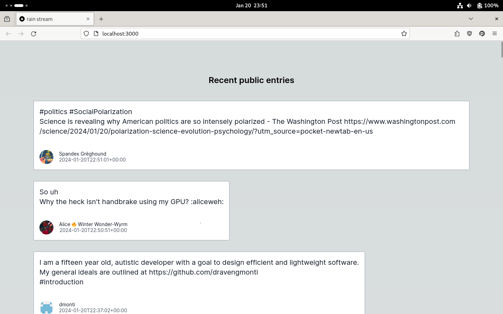

# rain-stream-task

## About

Consists of Python/FastAPI backend that connects to a Mastodon instance (as per `MASTODON_CLIENT_SECRET`). It reads the entries from the public feed and exposes them on the `/public` API endpoint as a new-line delimitated JSON stream where each chunk is a Mastodon post.

It also contains a Next.js client that connects to the backend endpoint and fetches the stream using the Streams API.



## Run

Provide your Mastodon login info in the `.env`:

``` shell
MASTODON_USER="email"
MASTODON_PASSWORD="password"
```

Potentially customize the following variables:

``` shell
MASTODON_CLIENT_SECRET="mastodon_clientcred.secret"
MASTODON_USER_SECRET="mastodon_usercred.secret"
MASTODON_MAX_ENTRIES=50
```

Run `docker compose up` to start the backend and the client app.

Launch http://localhost:3000/ in the browser.

## Run backend unit tests

``` shell
python -m venv venv
venv/bin/pip install -r requirements.txt
venv/bin/pip install -r requirements_dev.txt
venv/bin/python -m unittest tests.py
```

## Known issues, limitations

- Mastodon posts are stored in-memory whose number is limited by a constant
- Clients will start reciving entries since the backend was started, not when the client connected
- There's no client-side JSON validation
- Backend must be running before client is launched
